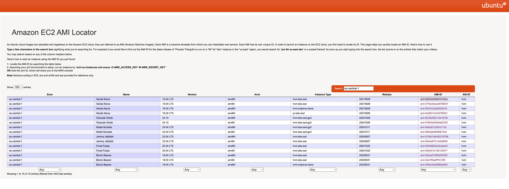

# Terraform console - terraform console
## Terraform
### terraform init 
### terraform fmt instance.tf 
### terraform plan -> dry-run
### terraform plan -out out.terraform
### terraform plan -out file ; terraform apply file ;
### terraform apply
### terraform apply out.terrafrom
### terraform apply -auto-approve

### terraform destroy
### terraform destroy -auto-approve

To delete the repository use the command ‘terrafom destroy’. Must have admin rights to Repository
terrafom destroy

# https://cloud-images.ubuntu.com/locator/ec2/

# aws_instance.example will be created
### terraform plan -> dry-run
+ resource "aws_instance" "example" {
    + ami                                  = "ami-08734ec479a1ace4a"
    + arn                                  = (known after apply)
    + associate_public_ip_address          = (known after apply)
    + availability_zone                    = (known after apply)
    + cpu_core_count                       = (known after apply)
    + cpu_threads_per_core                 = (known after apply)
    + disable_api_stop                     = (known after apply)
    + disable_api_termination              = (known after apply)
    + ebs_optimized                        = (known after apply)
    + get_password_data                    = false
    + host_id                              = (known after apply)
    + host_resource_group_arn              = (known after apply)
    + iam_instance_profile                 = (known after apply)
    + id                                   = (known after apply)
    + instance_initiated_shutdown_behavior = (known after apply)
    + instance_lifecycle                   = (known after apply)
    + instance_state                       = (known after apply)
    + instance_type                        = "t2.micro"
    + ipv6_address_count                   = (known after apply)
    + ipv6_addresses                       = (known after apply)
    + key_name                             = (known after apply)
    + monitoring                           = (known after apply)
    + outpost_arn                          = (known after apply)
    + password_data                        = (known after apply)
    + placement_group                      = (known after apply)
    + placement_partition_number           = (known after apply)
    + primary_network_interface_id         = (known after apply)
    + private_dns                          = (known after apply)
    + private_ip                           = (known after apply)
    + public_dns                           = (known after apply)
    + public_ip                            = (known after apply)
    + secondary_private_ips                = (known after apply)
    + security_groups                      = (known after apply)
    + source_dest_check                    = true
    + spot_instance_request_id             = (known after apply)
    + subnet_id                            = (known after apply)
    + tags_all                             = (known after apply)
    + tenancy                              = (known after apply)
    + user_data                            = (known after apply)
    + user_data_base64                     = (known after apply)
    + user_data_replace_on_change          = false
    + vpc_security_group_ids               = (known after apply)
